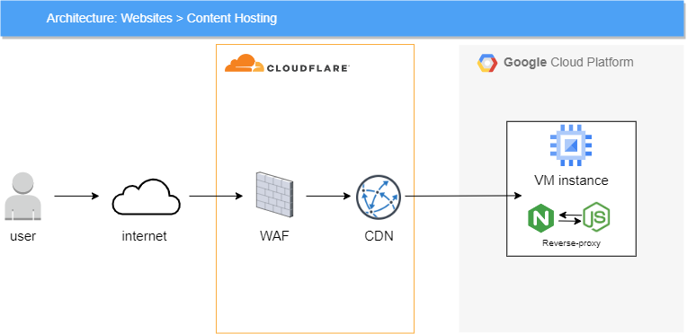
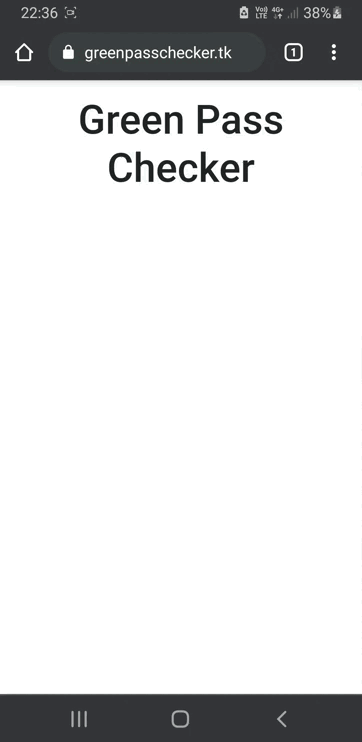
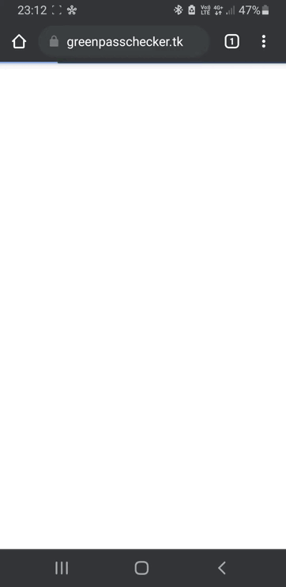
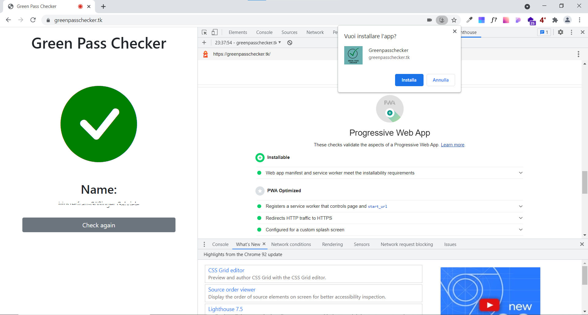
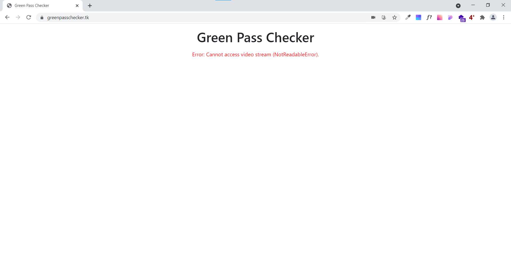

# PWA-greenpasschecker
Progressive Web Application to scan and check the european COVID-19 green pass QR code.<br>
The following project is for illustration purposes only.<br>
Project inspired by https://gist.github.com/lmillucci/48804b0598553689fc5054da10e63231 <br>

<h2> Introduction </h2>
This Progressive Web Application allows you to scan and check if your green pass QR code is valid. If the QR code is valid it provides you the full name linked to the green pass scanned.<br>
Thanks to PWA technology you can easily download and run the app on your device. 

<h2> Description </h2>
The PWA runs on the NodeJs runtime and uses the Express framework.<br>
I used a minimal responsive design with Bootstrap 5.<br>
To implemet the QR code scanner I used Instascan library. Link: https://github.com/schmich/instascan <br>
Instascan generates the QR code string result, then it is decoded in base45 format, it is decompressed, afterwards the result is decoded using Concise Binary Object Representation format and finally the result is serialized in Json.

<b> Link: https://greenpasschecker.ml/ </b>

<h2>&#x1F53A; Warning &#x1F53A; </h2>

Replace the content of "certificate.pem" file with your ssl public key.<br>
Replace the content of "privatekey.pem" file with your ssl private key. <br>
Replace the content of "certrequest.csr" file with your Certificate Signing Request.<br>
Replace the content of public/manigest.json > "start_url": "https://yourdomain.com" with your domain

To make Nginx proxy reverse running Nodejs applications you have to setup your server with these commands:
```
sudo apt-get update
sudo apt-get install nodejs

#update Nodejs to version 14.16.1
sudo npm install -g n
sudo n 14.16.1
node -v

#create the project space
mkdir /var/www/
cd /var/www/

#clone this repository into the new folder

#install the necessary packages
npm install base45 cbor jpeg-js jsqr pako

#install and configure Nginx
sudo apt-get install nginx -y
sudo vim /etc/nginx/sites-available/default.conf
#copy and paste the instructions in nginx/default.conf of this repository
sudo vim /etc/nginx/sites-available/greenpasschecker.conf
#copy and paste the instructions in nginx/greenpasschecker.conf of this repository
nginx -t
sudo service nginx restart

```
I used Ubuntu server provided by Google Cloud Platform.<br>
<br>
Infrastructure diagram
<br>
<br>
<br>


<h2> Images </h2>

Demonstration of use
<br>
<br>
<br>

Install the PWA
<br>
<br>
<br>

Google Lighthouse PWA audit
<br>
<br>
<br>

Error handler
